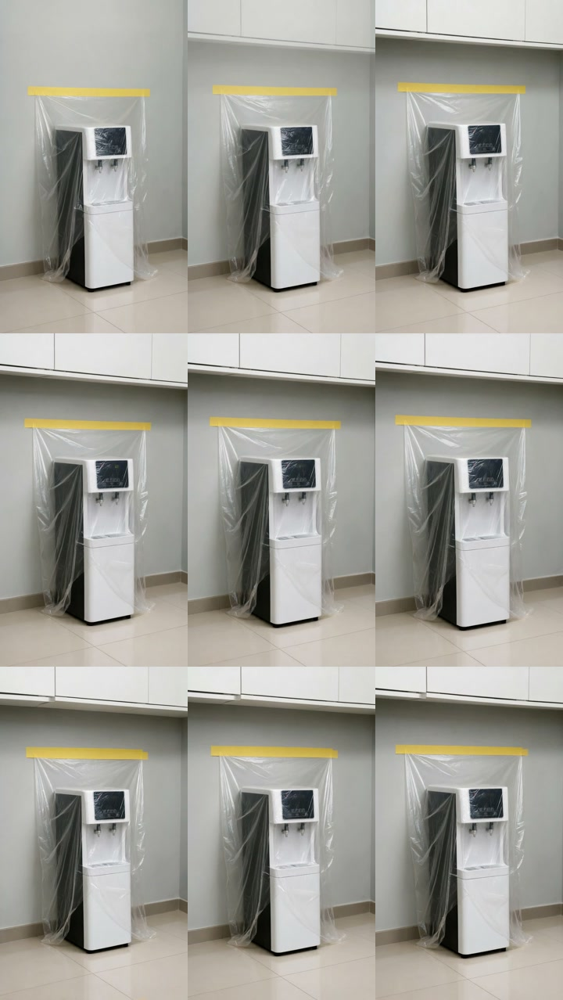

# 饮水机：胶带贴墙固定

## 一句话结论

本轮 3 条视频严格通过 3 条，当前场景通过率为 **3/3**。可以作为“防尘膜覆盖立式落地电器”的可用素材基线。

## 固定输入

- 物体：白黑配色立式饮水机；
- 环境：室内茶水间，饮水机靠近平整墙面；
- 产品状态：一体式透明 PE 防尘膜已经覆盖完成；
- 固定方式：单条黄色美纹胶贴在饮水机上方墙面，胶带与膜上沿等宽并永久连接；
- 镜头：竖屏、中景、平视、缓慢轻推；
- 变量：3 条视频共用同一张合格首帧与同一套提示词，只观察视频模型的随机性。

## 结果

| 案例 | 技术结果 | 物理关系 | 稳定性 | 严格结论 |
| --- | --- | --- | --- | --- |
| [案例 01](案例视频/案例-01.mp4) | 10.04 秒，可完整解码 | 黄胶在墙上，膜从胶带下沿连续覆盖饮水机 | 无明显结构跳变 | 通过 |
| [案例 02](案例视频/案例-02.mp4) | 10.04 秒，可完整解码 | 黄胶在墙上，膜从胶带下沿连续覆盖饮水机 | 无明显结构跳变 | 通过 |
| [案例 03](案例视频/案例-03.mp4) | 10.04 秒，可完整解码 | 黄胶在墙上，膜从胶带下沿连续覆盖饮水机 | 无明显结构跳变 | 通过 |

## 验收依据

对比图每一行对应一个案例，从左到右分别为 1 秒、5 秒、9 秒。三条视频均满足：

1. 黄色胶带始终位于饮水机上方墙面，没有移到机器外壳；
2. 胶带两端可见，透明膜与胶带下沿连续连接，不再出现“胶带横贯整面墙、膜只接中间一段”的错误；
3. 透明膜持续覆盖饮水机正面和两侧，未凭空消失或变成不透明布料；
4. 饮水机、墙面和胶带在 10 秒内没有明显融化、增生或跳变；
5. 画面变化限于缓慢推镜和膜边缘轻微波动，适合作为后续广告剪辑中的应用展示素材。

## 本轮调用

- 首帧：先生成 1 张，发现产品结构错误后收紧提示词，再生成 1 张合格首帧；其余两个案例复用合格首帧；
- 视频：Grok Imagine Video 1.5 Fast，共 3 次，每次 10 秒；
- 视频任务硬上限：3 次、总计 30 秒、禁止自动重试；
- 脚本预估视频费用：约 ¥1.8，实际账单以供应商后台为准。

## 文件怎么读

- 想看结果：打开本文件、`三条对比图.jpg` 和 `案例视频/`；
- 想复刻参数：打开 `技术记录（不用看）/project.json`；
- `status.json`、`verify-report.json`、`keyframes/`、`clips/`、`质检帧/` 都是脚本运行记录，日常不用看。
