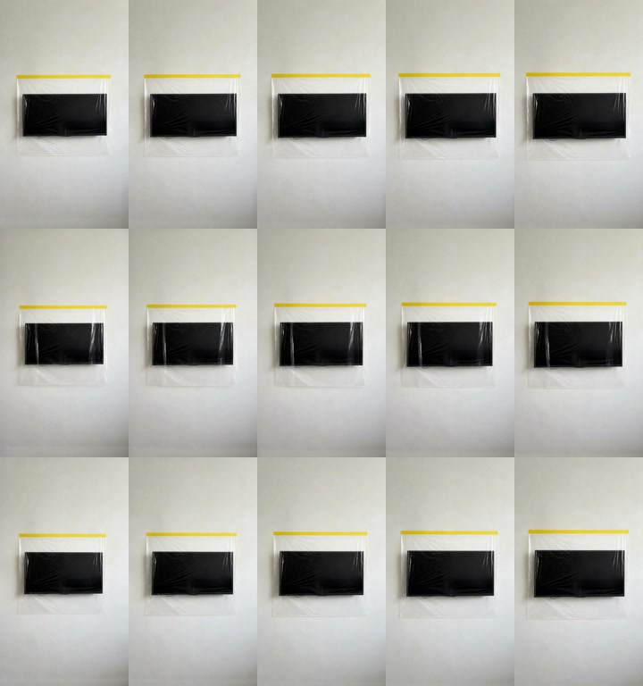

# 电视完整膜返工：通过

## 一句话结论

旧批次关键帧存在“膜未完整覆盖、胶带与膜边界可疑”的问题，原 3/3 结论作废。本次先引入关键帧硬门禁，再用同一张严格合格首帧生成 3 条视频；最终 **3/3 通过**。

## 关键帧先验收

首帧在进入视频模型前必须同时满足六项：膜连续无破洞、完整覆盖物体、胶带与膜全宽连续、胶带贴在墙面、只有一体式产品、无明显视觉伪影。首帧 SHA-256 为 `44441d399c1bf60f1fd3f850639c8fa998c56143f844ddf79a20ea307f0d4c86`，三条视频复用该首帧，只测试视频模型随机性。

前两轮共 6 张候选图全部被拒绝，原因包括胶带折卷、端点不齐、电视疑似位于膜前方。本轮没有拿这些坏图继续生成视频。

## 视频结果

| 案例 | 技术结果 | 产品结构 | 10 秒稳定性 | 结论 |
| --- | --- | --- | --- | --- |
| [案例 01](案例视频/案例-01.mp4) | 10.04 秒，完整解码 | 单张完整膜覆盖电视，黄胶在墙上且与膜连续 | 无破洞、断胶或结构跳变 | 通过 |
| [案例 02](案例视频/案例-02.mp4) | 10.04 秒，完整解码 | 单张完整膜覆盖电视，黄胶在墙上且与膜连续 | 左右竖向高光较明显，但属于透明膜反光，未形成缺口 | 通过 |
| [案例 03](案例视频/案例-03.mp4) | 10.04 秒，完整解码 | 单张完整膜覆盖电视，黄胶在墙上且与膜连续 | 无破洞、断胶或结构跳变 | 通过 |

## 调用与异常

- Grok Imagine Video 1.5 Fast：3 次 × 10 秒，禁止自动重试，估算约 ¥1.8；
- 案例 01、03 在轮询时分别遇到 HTTP 525、522，但原任务随后已完成；直接取回原任务结果，没有重新提交、没有重复计费；
- 三条均含供应商自动生成的 AAC 音轨，进入广告剪辑时应按素材用途决定静音或替换；
- 这次只证明“电视完成覆盖态”3 次随机生成可用，不代表所有物体都已稳定。

## 文件怎么读

- 看结果：本文件、`三条对比图.jpg`、`案例视频/`；
- 看参数和检查记录：`技术记录（不用看）/project.json`、`keyframe-review.json`；
- `rejected-keyframes/` 是被门禁拦下的错误图，仅供复盘，不能进入素材库。
